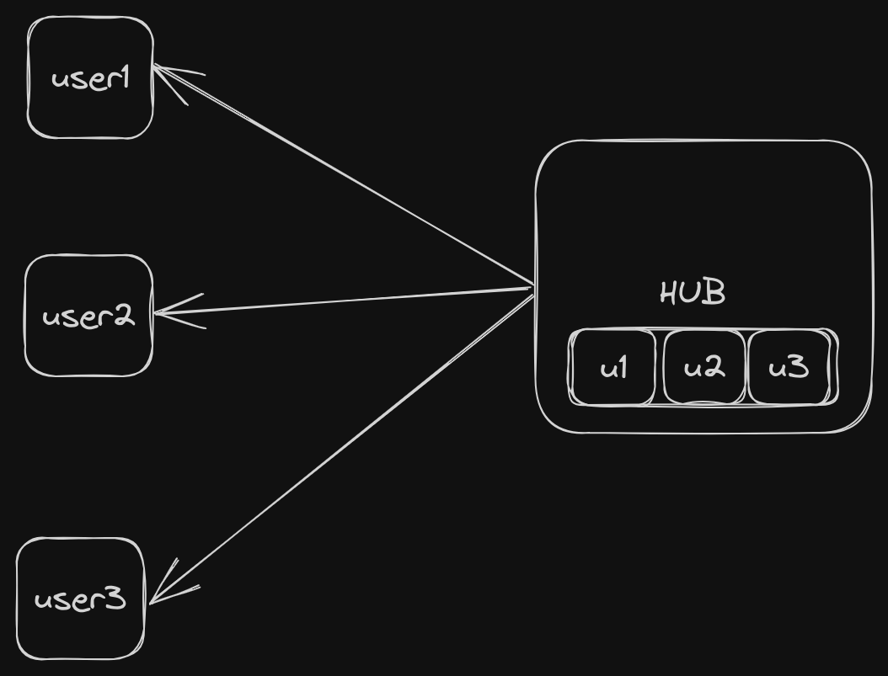

# ChatApp

## Architecture

- Here Hub Is central stature which contains all the clients.
- Hub runs a continous process which listens to a channel for new message values.
- When new message is recived its sent to respective client.
